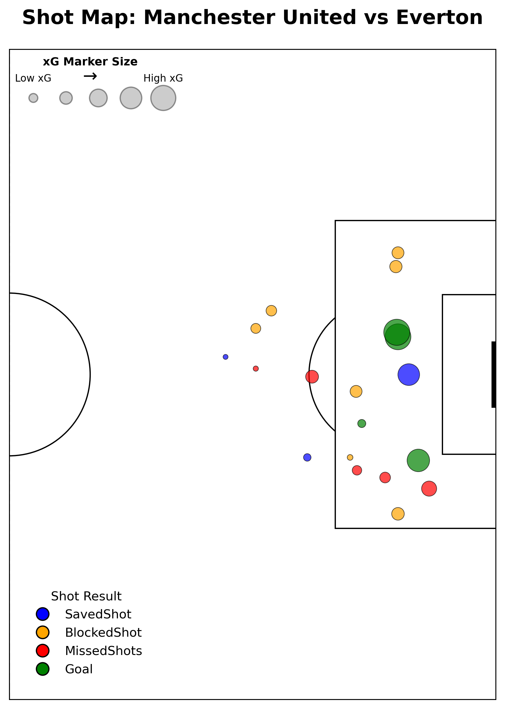

# prem-stats-tracker
A modular framework for football match analysis, visualization, and modeling — with a focus on Premier League data.  
This project currently uses [Understat](https://understat.com/) shot-level data to explore match performance and xG modeling.

## 📁 Project Structure

```
prem-stats-tracker/
├── data/              # Raw and processed match data
│   └── understat/     # Understat shot-level JSON files
├── plots/             # Generated visualizations
├── scripts/           # Core analysis scripts
├── utils/             # Helper functions (to come)
├── requirements.txt   # Python package dependencies
└── README.md

```


## ⚙️ Usage

Scripts can be run from the terminal using:

python scripts/load_understat_match.py
Match data is saved in /data/understat/ and organized by player.

## 📊 Example Output

The following shot map shows all shots in Manchester United vs Everton in match ID 26727 on a vertically cropped attacking half-pitch:




## 🛠️ Planned Features

- [X] Load and inspect Understat match data 
- [X] Visualize shots and goals on a pitch map  
- [ ] Generate basic match summaries  
- [ ] Add pass network plots  
- [ ] Build xG/xA summaries by player and team  


